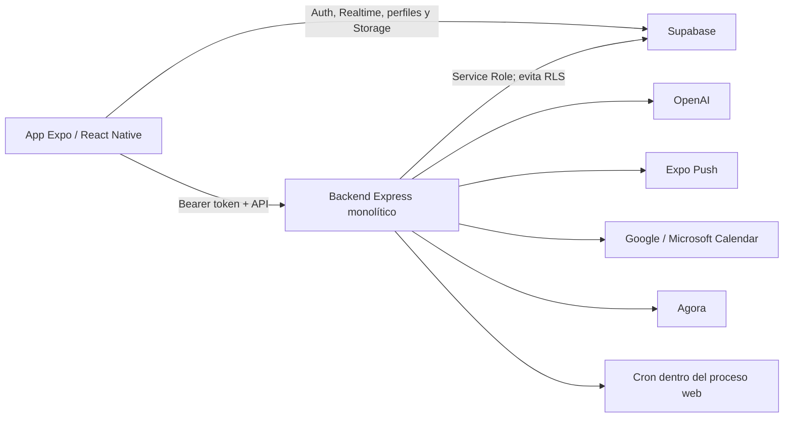

# Ping — Auditoría técnica de arquitectura

**Estado:** Informe de auditoría de sólo lectura  
**Base documental:** `docs/00-VISION-PING.md` a `docs/20-ADR-INDEX-ARCHITECTURE-PRINCIPLES.md`  
**Repositorio auditado:** rama `main`, commit `5ca5e55`

## Resumen ejecutivo

El repositorio puede evolucionar hacia la arquitectura aprobada, pero requiere una **reconstrucción parcial del núcleo funcional y de seguridad**.

No se recomienda un reinicio completo: existen componentes valiosos y probados. Sin embargo, no es prudente continuar agregando funcionalidades sobre el modelo actual antes de corregir autorización, Commitment, archivos, persistencia, Offline First, Synchronization y trazabilidad.

### Clasificación de observaciones

- **Hallazgo verificado:** observado directamente en código, configuración, documentación o validaciones ejecutadas.
- **Inferencia:** conclusión razonable derivada de evidencia verificada, pero no comprobada contra un entorno desplegado.
- **Recomendación:** acción propuesta para acercar la implementación al modelo aprobado.
- **Decisión pendiente:** asunto que requiere definición de producto o un ADR antes de implementar.

## 1. Estado real del repositorio

- **Hallazgo verificado:** el repositorio se encuentra en la rama `main`, commit `5ca5e55`.
- **Hallazgo verificado:** es un monorepositorio con aplicación Expo/React Native, backend Express/TypeScript y Supabase.
- **Hallazgo verificado:** contiene una aplicación funcional en forma de beta o prototipo avanzado, no una implementación completa de los documentos 00–20.
- **Hallazgo verificado:** conviven tres generaciones de modelo de datos:
  1. `supabase/schema.sql` y `supabase/schema.full.sql`;
  2. numerosos archivos `backend/phase*.sql`;
  3. el baseline V2 en `supabase/migrations/`.
- **Hallazgo verificado:** la documentación de migración reconoce que la base histórica no puede reconstruirse solamente desde el repositorio y que el baseline V2 no era directamente compatible con el código existente.
- **Hallazgo verificado:** `README.md` continúa ordenando aplicar `supabase/schema.full.sql`, contradiciendo la ruta V2 definida en `supabase/migrations/README.md`.
- **Decisión pendiente:** no puede determinarse mediante inspección local cuál esquema está desplegado actualmente, si V2 fue aplicado completamente ni si existe drift adicional.
- **Hallazgo verificado:** no existe configuración CI versionada ni evidencia automatizada de pruebas contra una instancia Supabase reconstruida desde cero.
- **Hallazgo verificado:** la configuración móvil no contiene `eas.json`; existe configuración Expo básica en `mobile/app.json`.

## 2. Arquitectura actual identificada

### Aplicación móvil

La aplicación utiliza:

- Expo y React Native;
- React Navigation;
- React Query;
- Supabase Auth;
- Supabase Realtime;
- Supabase Storage;
- SecureStore;
- AsyncStorage;
- NetInfo.

El cliente combina acceso directo a Supabase con llamadas al backend.

### Backend

El backend utiliza Express 5 y TypeScript. Está organizado en controladores, servicios, middleware y utilidades, pero expone desde un único router:

- Conversation;
- grupos;
- mensajes;
- Commitment;
- People mediante perfiles y contactos;
- Search;
- IA;
- Insights;
- calendarios;
- llamadas;
- modo Operación y checklists.

### Datos

El baseline V2 utiliza PostgreSQL/Supabase y define RLS para el acceso directo del cliente. El backend utiliza `service_role`, por lo que evita RLS y depende de que cada ruta aplique correctamente sus verificaciones de autorización.

### Integraciones

Existen integraciones directas con:

- OpenAI;
- Expo Push;
- Agora;
- Google Calendar;
- Microsoft Outlook Calendar.

### Procesos programados

Los recordatorios, el resumen matutino y la revisión semanal se ejecutan dentro del mismo proceso web del backend.

### Despliegue

El backend tiene un blueprint para Render con:

- plan gratuito;
- región Oregon;
- despliegue automático por commit;
- cron habilitado dentro del proceso web.

No se verificó el estado real de un despliegue activo.

## 3. Funcionalidades existentes y nivel de madurez

| Capacidad | Existencia | Madurez verificada |
|---|---|---|
| Aplicación móvil | Navegación, chats, compromisos, búsqueda, IA, grupos, llamadas y Operación | Beta; demasiada superficie fuera del MVP |
| Autenticación | Supabase Auth, sesión en SecureStore y validación del bearer token | Media |
| Conversation | Self-chat, conversaciones directas y grupales, mensajes, respuestas, reacciones y Realtime | Media-alta para funcionamiento online |
| Commitment | Creación, asignación, propuesta, avance, resolución, seguimiento e historial | Media, con contradicciones conceptuales |
| People | Perfiles, contactos externos y sincronización de teléfonos | Baja |
| Memory | No existe un modelo propio | Ausente |
| IA | Detección, resumen, chat IA, transcripción y resúmenes automáticos | Prototipo con riesgos críticos |
| Search | Mensajes, compromisos, contactos, perfiles y grupos | Parcial |
| Retrieval | No existe como capacidad distinguible | Ausente |
| Files & Attachments | URLs codificadas dentro del texto del mensaje | Prototipo |
| Notifications | Envío directo de push | Transporte parcial, no modelo conceptual |
| Offline First | Cola local únicamente para mensajes | Prueba de concepto |
| Synchronization | Booleano éxito/fallo al reenviar la cola | Ausente como modelo funcional |
| Events | `commitment_events` y tipos de mensajes de sistema | Parcial y no atómico |
| Audit & Traceability | Eventos de Commitment y logs de consola | Muy baja |
| Privacy | Algunas RLS y preferencia de confirmación de lectura | Insuficiente |
| Despliegue | Blueprint Render del backend | Parcial; no verificado en vivo |

La aplicación móvil presenta “Tablero”, “Tareas”, “Operación”, grupos, checklists y llamadas como navegación activa. Esto sobrepasa el MVP aprobado, que dejó llamadas, calendarios externos y modo Operación fuera de alcance.

## 4. Matriz de trazabilidad entre documentos 00–20 e implementación

| Documento | Implementación encontrada | Evaluación |
|---|---|---|
| 00 — Visión | Mobile, self-chat, contexto y compromisos existen | Parcial |
| 01 — MVP Scope | El flujo principal existe, pero se mezcló con grupos, calendario, llamadas, tableros y Operación | Contradicho en alcance |
| 02 — Design Principles | Hay confirmaciones y procedencia parcial; autonomía y control son inconsistentes | Parcial |
| 03 — User Mental Model | La interfaz usa “tareas”, “tablero”, “agendar” y “chat IA” | Contradicho |
| 04 — Conversation | Conversaciones, mensajes, participantes, self-chat y procedencia básica | Madurez media |
| 05 — Commitment | Ciclo de vida amplio y separación entre avance y resolución | Parcial con contradicciones graves |
| 06 — People | Perfiles y contactos, sin identidad incompleta, evolución ni resolución de ambigüedad | Madurez baja |
| 07 — Memory | No hay recuerdo, relevancia, permanencia ni recuperación contextual propios | Ausente |
| 08 — AI | Sugiere, transcribe y resume; también modifica mensajes y crea resúmenes autónomos | Límite incumplido |
| 09 — Authorization | Auth y RLS existen; el backend depende de controles manuales incompletos | Riesgo crítico |
| 10 — Events | Sólo Commitment tiene eventos estructurados; mensajes de sistema mezclan conceptos | Madurez baja |
| 11 — Notifications | Push inmediato y cron, sin entidad, vigencia, prioridad o estado conceptual | Madurez baja |
| 12 — Search & Retrieval | Search parcial; Retrieval no está separado | Parcial / ausente |
| 13 — Files & Attachments | Subida a bucket y URL textual; no existe File/Attachment conceptual | Contradicho |
| 14 — Offline First | Cola AsyncStorage únicamente para mensajes | Prueba de concepto |
| 15 — Synchronization | No hay idempotencia, causalidad, conflicto ni resultado desconocido | Ausente |
| 16 — Audit & Traceability | Eventos de Commitment no atómicos y logs técnicos | Insuficiente |
| 17 — Privacy | RLS parcial, pero exposición pública, enumeración y recopilación adicional | Insuficiente |
| 18 — Ubiquitous Language | Código e interfaz conservan `Task`, `completed`, `Tablero` y `agendar` | Contradicho |
| 19 — Business Rules | Varias reglas centrales son vulneradas | Contradicho |
| 20 — Architecture Principles & ADR Index | El índice está listo, pero los límites técnicos aún no existen | Documento listo; implementación pendiente |

## 5. Brechas funcionales y técnicas

### Memory

Memory está completamente ausente como capacidad funcional. La tabla `ai_messages` conserva un historial de interacción con IA, pero no equivale a Memory.

### Retrieval

Search devuelve filas y relaciones, pero no existe una capacidad distinguible de recuperación contextual que conserve explícitamente:

- fuente;
- propósito;
- alcance;
- autorización;
- contexto suficiente.

### People

Los contactos y perfiles actuales no representan:

- referencias incompletas;
- ambigüedad de identidad;
- identidad corregible;
- evolución de relaciones;
- contexto de la relación desde la perspectiva del usuario.

### Commitment

El modelo actual:

- representa propuesta, rechazo y cancelación como estados del propio compromiso;
- no exige ni conserva un resultado comprensible al resolver;
- permite borrado físico;
- mantiene implícitas algunas reglas de colaboración y autoridad para aceptar o rechazar.

### Files & Attachments

No existe:

- una entidad conceptual;
- una relación propietaria formal;
- versionado conceptual;
- eliminación contextual;
- autorización derivada del recurso propietario.

### Notifications

No existe registro funcional de:

- motivo;
- vigencia;
- prioridad;
- destinatario;
- estado.

La implementación sólo envía un push por un canal técnico.

### Offline First y Synchronization

La cola offline:

- conserva mensajes en AsyncStorage;
- llama a un callback;
- recibe un booleano;
- elimina el elemento si el booleano indica éxito.

No representa:

- presentación;
- recepción;
- aceptación;
- rechazo;
- resultado desconocido;
- duplicado;
- causalidad;
- conflicto;
- autorización vencida.

### Audit & Traceability

La transición del compromiso se confirma antes de insertar su evento. Si la inserción de evidencia falla, el error se registra en consola, pero no se revierte la transición.

### Datos y módulo Operación

El módulo Operación consulta tablas y columnas que el baseline V2 excluye expresamente. Todavía utiliza, entre otros:

- `group_conversation_id`;
- estado `completed`;
- `operation_checklists`;
- `shift_reports`;
- `conversation_operation_focuses`;
- `commitment_operation_progress`;
- `mode`;
- `pinned_message_id`;
- `active_commitment_id`.

### Despliegue y operación

- No existen perfiles móviles reproducibles de build y distribución.
- No hay observabilidad formal.
- No hay métricas o alertas.
- No existe separación clara entre observabilidad técnica y Audit.

## 6. Contradicciones con Business Rules y Ubiquitous Language

| Regla aprobada | Implementación actual |
|---|---|
| Una propuesta no es un compromiso | `commitments.status` incluye `proposed` y `rejected` |
| Rechazar una propuesta no origina Commitment | Se conserva una fila `commitments` con estado `rejected` |
| Cancelación permanece como decisión pendiente | Existe estado, endpoint y transición `cancelled` |
| Resolver conserva un resultado comprensible | `/resolve` no recibe ni exige resultado |
| Eliminación no reescribe la historia | Commitment, mensajes y grupos admiten borrado físico; eventos usan `ON DELETE CASCADE` |
| La IA no modifica dominios por iniciativa propia | El análisis actualiza metadata del mensaje y el cron introduce resúmenes IA en self-chat |
| Sincronizado no significa confirmado | La cola offline reduce el resultado a éxito o fallo |
| File siempre pertenece conceptualmente a un recurso | Sólo existe una URL dentro de una cadena textual |
| Search no revela recursos no autorizados | La búsqueda backend consulta globalmente perfiles mediante service role |
| Ping no es un gestor de tareas ni un calendario | La interfaz principal expone “Tablero”, “Tareas” y calendario |
| El Storage actual es privado | El script configura `chat-media` como público y el cliente solicita URL pública |
| README debe ser consistente con la visión | README afirma creación automática de compromisos y una arquitectura completamente preparada |

## 7. Riesgos de seguridad, privacidad, integridad y pérdida de información

### Riesgos críticos o altos

#### Acceso directo indebido en rutas de IA

**Hallazgo verificado:** `summarize` recupera mensajes por `conversationId` sin comprobar participación. `analyzeMessage` recupera cualquier mensaje por ID mediante service role.

**Inferencia:** un usuario autenticado que conozca o adivine un identificador podría procesar contenido de una conversación ajena.

#### Estado de mensajes sin autorización suficiente

**Hallazgo verificado:** cualquier usuario autenticado que conozca el ID de un mensaje puede intentar marcarlo como entregado o leído. No se comprueba pertenencia a la conversación ni condición de destinatario.

#### Enumeración de identidades

**Hallazgo verificado:** `/users` y Search consultan perfiles globalmente y devuelven email o teléfono, eludiendo mediante service role la política RLS que limitaría perfiles a conversaciones compartidas.

#### Archivos potencialmente públicos

**Hallazgo verificado:** el cliente obtiene una URL pública y utiliza rutas basadas sólo en timestamp o nombre, con `upsert`.

**Decisión pendiente:** no se verificó el estado real del bucket desplegado, pero la intención del código y del script de configuración es hacerlo público.

#### Descarga arbitraria de URLs

**Hallazgo verificado:** el audio entregado por el usuario se descarga mediante Axios sin allowlist, límite de tamaño, timeout ni validación de destino.

**Inferencia:** esto puede habilitar SSRF y agotamiento de recursos.

#### OAuth state inseguro

**Hallazgo verificado:** los callbacks de calendario utilizan directamente `state` como `userId`, sin evidencia de firma, nonce ni relación verificable con una sesión.

#### Tokens de dispositivo versionados

**Hallazgo verificado:** existen Expo Push Tokens reales dentro de un script de pruebas versionado.

**Recomendación:** deben considerarse comprometidos, revocarse o rotarse y eliminarse en una corrección futura autorizada.

#### Evidencia no atómica

**Hallazgo verificado:** una transición de Commitment puede quedar aplicada sin su evento de auditoría.

#### Borrado destructivo

**Hallazgo verificado:** eliminar Commitment borra su historial por cascada. Eliminar un grupo borra mensajes y participantes.

#### XSS reflejado potencial

**Hallazgo verificado:** la página pública de llamadas interpola parámetros de consulta sin escape dentro de JavaScript.

#### Información sensible en logs

**Hallazgo verificado:** se registran fragmentos de mensajes, identificadores y tokens inválidos.

#### Dependencias vulnerables

La auditoría de dependencias de producción reportó:

- backend: 10 vulnerabilidades — 5 altas, 4 moderadas y 1 baja;
- mobile: 26 vulnerabilidades — 2 críticas, 8 altas, 15 moderadas y 1 baja.

El impacto real de algunas dependencias móviles depende de si se ejecutan únicamente durante build, pero deben clasificarse antes de publicar una beta.

### Riesgos medios

- Cola offline en AsyncStorage sin protección adicional.
- Heartbeat de `last_seen` cada dos minutos.
- Captura de idioma y región sin un propósito visible.
- Lock biométrico que se desbloquea automáticamente si no existe biometría enrolada.
- CORS que acepta cualquier origen cuando `ALLOWED_ORIGINS` está vacío.
- Posible duplicación de cron si existen varias instancias.
- Falta de registro idempotente de notificaciones programadas.
- Render gratuito puede suspender el proceso y no constituye una base confiable para cron.
- `createOrFind` puede devolver una conversación grupal compartida en lugar de una conversación directa porque no filtra `conversation_type`.

## 8. Deuda técnica

- Tres fuentes de verdad SQL.
- Documentación operativa contradictoria.
- Cuarenta y cinco scripts temporales de diagnóstico o migración versionados.
- Dos clientes administrativos Supabase distintos.
- Backend organizado en archivos por capas, pero no en módulos alineados a dominios.
- Uso transversal de `any`.
- Compatibilidad V1/V2 integrada en flujos principales.
- Contratos API no versionados ni compartidos.
- Archivos de interfaz y servicios excesivamente grandes.
- Ausencia de transacciones que unan cambio y evidencia.
- Estado único `messages.status`, insuficiente para varios destinatarios.
- Cron, API y automatizaciones dentro del mismo proceso.
- Integraciones y proveedores acoplados directamente.
- Ausencia de pruebas de integración de rutas, RLS, Storage, Realtime, offline y sincronización.
- Ausencia de CI, pruebas E2E, pruebas automáticas de migración y restauración verificada.

## 9. Componentes reutilizables

- Baseline V2 como punto de partida estructural.
- RLS y triggers de consistencia del baseline V2.
- Migración que corrige permisos de funciones `SECURITY DEFINER`.
- Funciones puras de transición de Commitment.
- Separación entre `action_completed_at` y `resolved_at`.
- Self-chat y compatibilidad de Conversation.
- Middleware de autenticación.
- Request ID, Helmet, rate limit y validación Zod.
- Helpers de autorización, si se convierten en una política sistemática.
- React Query, navegación y parte de los componentes de Conversation.
- Adaptadores de compatibilidad V2 como herramienta temporal de migración.
- Parser de fechas y clasificadores de compromisos.
- Servicio de push como adaptador técnico.
- Suite unitaria existente como red inicial de regresión.

## 10. Componentes que deberían corregirse o reemplazarse

### Corregir

- Todas las rutas que utilizan service role, empezando por IA, estado de mensajes, Search y usuarios.
- Modelo visible de Commitment, resolución y seguimiento.
- Cliente API móvil:
  - timeout;
  - cancelación;
  - errores estructurados;
  - idempotencia;
  - resultado desconocido.
- Selección de conversaciones directas.
- Privacidad de presencia.
- Bloqueo local.
- Logs.
- Configuración de entornos.
- CI y despliegue.
- Tests backend sensibles a timeouts durante ejecución paralela.

### Reemplazar o rediseñar

- Modelo de propuesta, rechazo y cancelación dentro de `commitments`.
- Cadena textual como representación de archivos.
- Bucket público y acceso por URL pública.
- Cola offline booleana.
- Registro de auditoría posterior y no atómico.
- SQL heredado como mecanismo de evolución.
- Automatizaciones IA que escriben directamente en Conversation.
- Cron dentro del proceso web para funciones críticas.
- Search global de perfiles.
- Callbacks OAuth basados en `state=userId`.
- Módulo Operación actual.

El módulo Operación debería aislarse hasta decidir si se conserva fuera de Ping Core.

## 11. Pruebas y validaciones ejecutadas

| Validación | Resultado real |
|---|---|
| Backend TypeScript `tsc --noEmit` | Exit 0 |
| Mobile TypeScript `tsc --noEmit` | Exit 0 |
| Mobile lint | Exit 0 |
| Mobile tests | 4 archivos, 42 de 42 pruebas aprobadas |
| Backend tests, ejecución normal paralela | 148 de 150; dos timeouts |
| Backend tests, un solo worker | 16 archivos, 150 de 150 pruebas aprobadas |
| Auditoría de dependencias backend | 10 vulnerabilidades |
| Auditoría de dependencias mobile | 26 vulnerabilidades |
| `git diff --check` durante la auditoría de sólo lectura | Sin errores |
| `git status --short` al cerrar la auditoría de sólo lectura | Limpio |

No se ejecutaron:

- builds, porque generan `dist`;
- migraciones;
- scripts conectados a Supabase;
- pruebas sobre producción;
- E2E;
- despliegues.

Por lo tanto, no se consideran verificados en funcionamiento real:

- Auth contra el entorno remoto;
- Realtime;
- Storage;
- base de datos desplegada;
- servicio Render;
- integraciones externas.

## 12. ADR fundacionales recomendados

### 1. ADR-001, ADR-002 y ADR-003 — Arquitectura general, módulos y dependencias

Deben definir Ping Core antes de continuar construyendo.

### 2. ADR-005, ADR-006 y ADR-008 — Propiedad de datos, estrategia de datos y migraciones

Deben resolver:

- las tres fuentes SQL;
- el modelo canónico;
- la migración desde el modelo histórico;
- el tratamiento de datos existentes.

### 3. ADR-013 y ADR-014 — Authorization, Privacy y minimización

Deben preceder cualquier beta que utilice datos reales.

### 4. ADR de Commitment

Debe formalizar:

- Proposal frente a Commitment;
- confirmación;
- rechazo;
- cancelación;
- avance;
- resolución;
- resultado;
- eliminación;
- reconstrucción histórica.

### 5. ADR-009, ADR-015, ADR-016 y ADR-017 — Consistencia, Events, Audit y Traceability

Deben impedir estados confirmados sin evidencia y definir qué cambios necesitan confirmarse conjuntamente.

### 6. ADR-019 y ADR-020 — Datos offline, acciones pendientes y resultado desconocido

Son necesarios antes de reemplazar la cola actual.

### 7. ADR-024 — Files

Debe corregir expresamente el supuesto de que el Storage actual es privado.

### 8. ADR-026, ADR-027 y ADR-028 — IA

Deben separar:

- capacidad de IA;
- autoridad de escritura;
- proveedor;
- procedencia;
- incertidumbre;
- degradación;
- confirmación del usuario.

### 9. ADR-029, ADR-030 y ADR-031 — Search, Retrieval y Memory

Deben definir sus límites y relaciones antes de implementar recuperación contextual.

### 10. ADR-035, ADR-036 y ADR-037 — Despliegue, secretos, backup y recuperación

Deben formalizar entornos, configuración, continuidad y recuperación.

### Decisiones que deberían permanecer postergadas

ADR-021, ADR-022 y ADR-023 sobre sincronización avanzada, conflictos y múltiples dispositivos deberían esperar hasta definir exactamente qué operaciones estarán disponibles offline en la primera beta.

## 13. Propuesta de siguientes fases

### Fase 1 — Contención inmediata

Corregir o deshabilitar:

- accesos indebidos en IA;
- cambio de estado de mensajes sin autorización;
- enumeración de identidades;
- OAuth inseguro;
- archivos públicos;
- tokens expuestos;
- descarga arbitraria de URLs;
- XSS;
- automatizaciones inseguras fuera del MVP.

### Fase 2 — Fuente de verdad de datos

- Inventariar la base remota.
- Compararla con V2.
- Crear staging reproducible.
- Aplicar las migraciones canónicas.
- Verificar Auth, RLS, Realtime y Storage.
- Decidir la migración de datos existentes.

### Fase 3 — Arquitectura modular

- Establecer Ping Core.
- Definir límites de módulos.
- Definir únicos puntos de escritura por dominio.
- Definir dirección de dependencias.

### Fase 4 — Commitment canónico

- Separar Proposal de Commitment.
- Formalizar confirmación y rechazo.
- Exigir resultado comprensible.
- Resolver cancelación.
- Preparar migración de datos.

### Fase 5 — Authorization y Privacy

- Crear matriz de recursos y acciones.
- Aplicarla sistemáticamente al backend.
- Alinear RLS y Storage.
- Incorporar propósito y minimización.

### Fase 6 — Events, Audit y Traceability

- Garantizar atomicidad.
- Distinguir hechos, intentos, rechazos y resultados desconocidos.
- Conservar evidencia proporcional.

### Fase 7 — Conversation y Files

- Consolidar mensajes y procedencia.
- Definir eliminación.
- Implementar archivos privados relacionados con recursos.

### Fase 8 — Offline First y Synchronization

- Idempotencia.
- Causalidad.
- Acciones pendientes.
- Rechazo.
- Conflicto.
- Resultado desconocido.
- Recuperación.

### Fase 9 — People, Memory, Search y Retrieval

- Implementar identidad contextual.
- Representar referencias incompletas.
- Incorporar Memory relevante.
- Separar Search de Retrieval.

### Fase 10 — IA transversal

Reintroducir IA mediante:

- propuestas;
- procedencia;
- incertidumbre;
- confirmación;
- límites de escritura.

### Fase 11 — Notifications y procesos

- Separar el modelo funcional del canal técnico.
- Implementar ejecución confiable e idempotente.
- Evitar cron crítico dentro del proceso web.

### Fase 12 — Calidad operativa

- CI;
- pruebas de integración Supabase;
- E2E;
- pruebas de seguridad;
- pruebas de migración;
- restauración;
- observabilidad;
- despliegue beta.

## 14. Veredicto

El repositorio no está perdido y no requiere una reconstrucción total.

Conversation online, partes de Commitment, el baseline V2, Auth, React Query, varios componentes móviles y las pruebas unitarias existentes constituyen una base reutilizable.

Sí se requiere una **reconstrucción parcial y controlada** de:

- límites de módulos;
- autorización;
- modelo de Commitment;
- archivos;
- auditabilidad;
- Offline First;
- Synchronization;
- Memory;
- Retrieval;
- automatizaciones IA;
- estrategia de datos y migraciones.

Continuar agregando funcionalidades antes de esa reconstrucción aumentaría el costo de migración y el riesgo de exponer o perder información.

## Evidencias principales

- `README.md`
- `supabase/migrations/README.md`
- `supabase/migrations/20260712000000_baseline_v2.sql`
- `supabase/migrations/20260713160000_fix_security_definer_execute_grants.sql`
- `backend/src/routes/index.ts`
- `backend/src/controllers/ai.controller.ts`
- `backend/src/controllers/message.controller.ts`
- `backend/src/controllers/search.controller.ts`
- `backend/src/controllers/calendar.controller.ts`
- `backend/src/controllers/agora.controller.ts`
- `backend/src/services/commitment.service.ts`
- `backend/src/services/message.service.ts`
- `backend/src/services/morningRoutine.service.ts`
- `backend/src/services/operation.service.ts`
- `backend/src/utils/commitmentEvents.ts`
- `mobile/src/navigation/index.tsx`
- `mobile/src/hooks/useOfflineSync.ts`
- `mobile/src/lib/upload.ts`
- `mobile/src/components/LockScreen.tsx`
- `mobile/src/context/AuthContext.tsx`
- `render.yaml`

## Estado de la auditoría

La auditoría original fue ejecutada en modalidad de sólo lectura:

- no modificó código;
- no modificó documentación existente;
- no modificó dependencias;
- no modificó base de datos;
- no modificó configuración;
- no realizó commit;
- no realizó push;
- no realizó despliegue.
